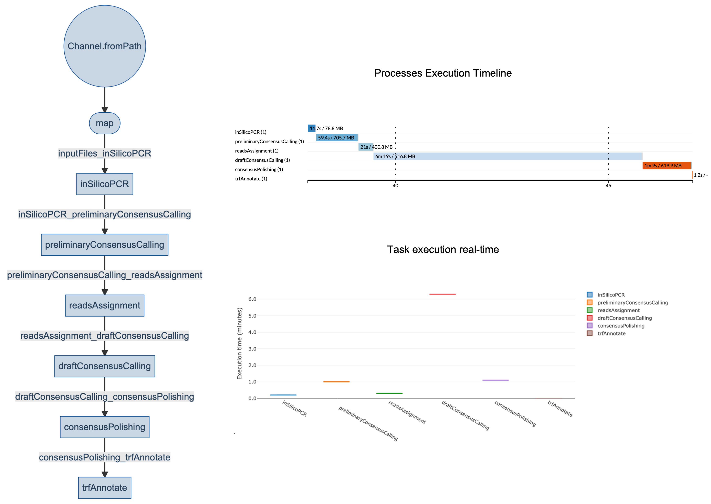
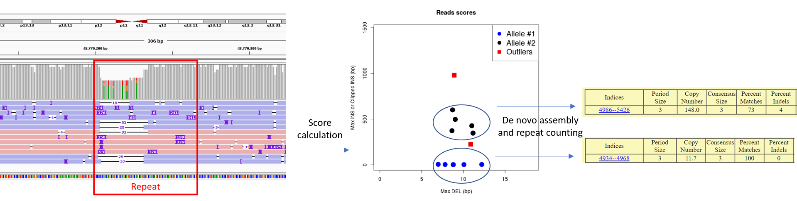
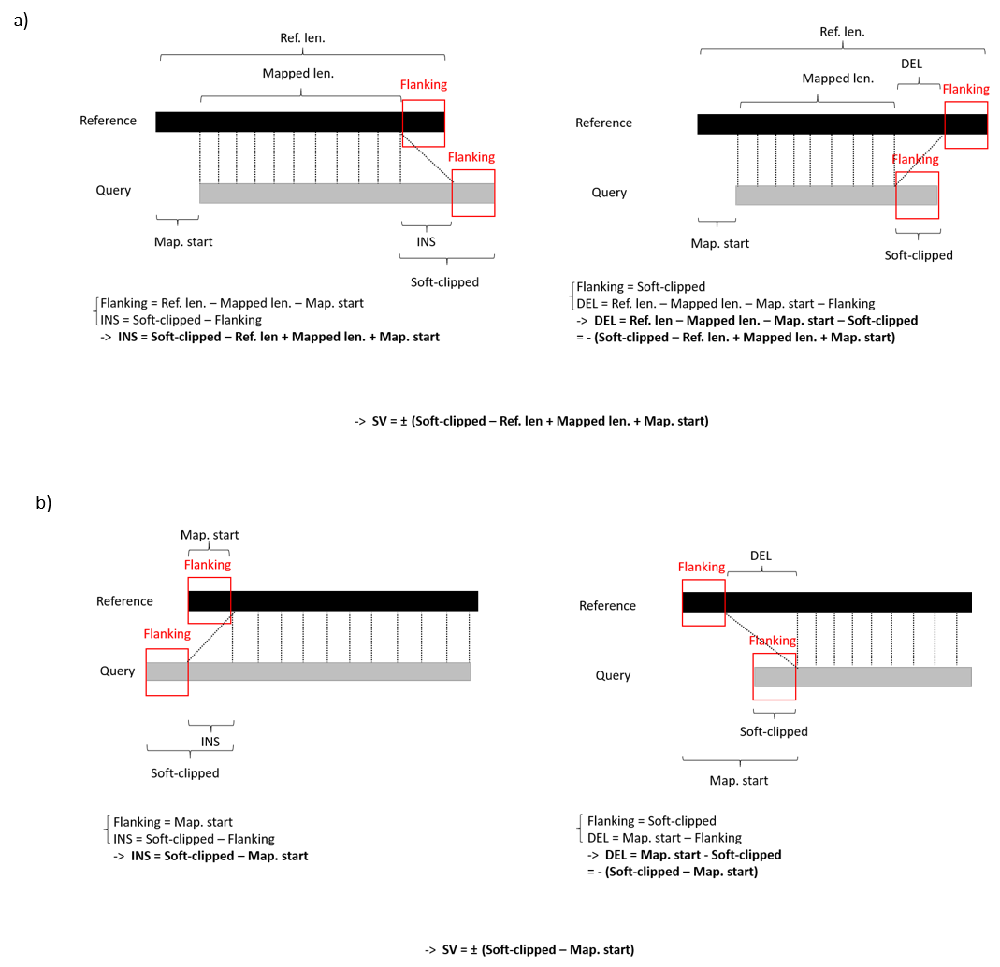
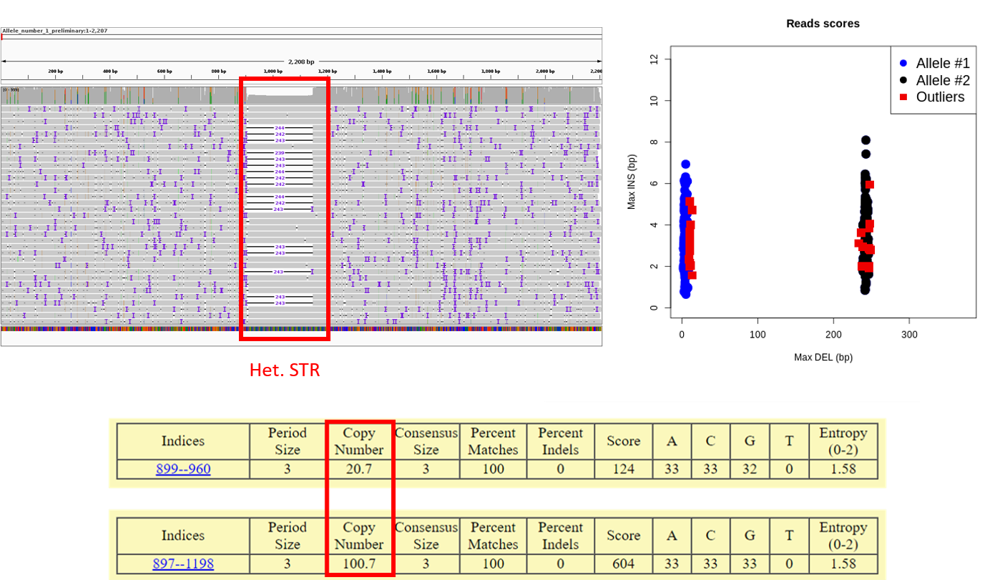

# CharONT2
**CharONT2** is a [Nextflow](https://www.nextflow.io) implementation of [CharONT](https://github.com/MaestSi/CharONT) pipeline, for characterizing long genomic regions starting from ONT reads on multiple samples and across multiple infrastructures in a streamlined, portable and reproducible manner. In particular, **CharONT2** is a consensus calling pipeline meant for characterizing long genomic regions - such as Short Tandem Repeats - from organisms with ploidy >= 1. Starting from ONT reads including a shared flanking sequence, it provides consensus sequences for each allele and tandem repeats annotations. In case you used an enrichment method different to PCR (e.g. CRISPR-Cas9), or performed WGS, amplicon-like sequences can be extracted _in-silico_ based on known flanking sequences.

<p align="center">
  
</p>

## Getting started

**Prerequisites**

* [Nextflow](https://nf-co.re/usage/installation)
* [Docker](https://docs.docker.com/engine/install/) or [Singularity](https://sylabs.io/guides/3.0/user-guide/installation.html)                                                                                  
                                                                                   
**Installation**

```
git clone https://github.com/MaestSi/CharONT2.git
cd CharONT2
chmod 755 *
```

## Overview

<p align="center">
  
</p>

**Reads assignment to each allele**

After creating a preliminary consensus sequence for Allele #1, all reads are mapped to it and, based on the CIGAR string, the biggest DEL and INS are identified for each read, resulting in a bidimensional Score. At this point, reads with either component of the Score deviating from the 1st or 3rd inter quartile range (IQR) for more than  _IQR\_outliers\_coef\_precl_\*IQR are labelled as candidate outliers, and are excluded from the k-means clustering. After clustering, IQR is computed within each cluster for both components of the Score, and reads with either component deviating from the 1st or 3rd IQR for more than _IQR\_outliers\_coef_\*IQR are labelled as outliers. Scores are plotted so that the user may tune _IQR\_outliers\_coef\_precl_ and _IQR\_outliers\_coef_ parameters according to their preferences, based on visual inspection of \<sample_name\>\_reads\_scores.png. In the provided example, reads from Allele #2 show 400 bp INS with respect to Allele #1. Notably, one read with 1000 bp INS is identified, which may indicate a somatic variant.

<p align="center">
  
</p>

Also in case the SV is too big to allow mapping of reads at both 5' and 3' flanking regions, the size of the SV is estimated from soft-clipping. In particular, depending on whether soft-clipping occurs at the 5' end **a)** or at the 3' end **b)**, a different formula is applied for calculating the size of the SV compared to Allele #1, used as a Reference.

<p align="center">
  
</p>


## Usage

The CharONT2 pipeline requires you to open CharONT2.conf configuration file and set the desired options. Then, you can run the pipeline using either docker or singularity environments just specifying a value for the -profile variable.

```
Usage:
nextflow -c CharONT2.conf run CharONT2.nf \
--fastq_files = "/path/to/files*.fastq" \
--scripts_dir = "/path/to/scripts_dir" \
--results_dir = "/path/to/results_dir" \
-profile docker

Mandatory argument:
-profile                                                              Configuration profile to use. Available: docker, singularity
Other mandatory arguments which may be specified in the CharONT2.conf file
--fastq_files                                                         Path to fastq files, use wildcards to select multiple samples
--results_dir                                                         Path to a folder where to store results
--num_alleles                                                         num_alleles represents the number of expected alleles
--PCRThr                                                              PCRThr is the identity threshold for in-silico PCR in case inSilicoPCR=true
--primerSeqOne                                                        primerSeqOne is a primer sequence used for in-silico PCR in case inSilicoPCR=true
--primerSeqTwo                                                        primerSeqTwo is a primer sequence used for in-silico PCR in case inSilicoPCR=true
--scripts_dir                                                         scripts_dir is the directory containing all scripts
--target_reads_consensus                                              target_reads_consensus defines the maximum number of reads used for consensus calling
--target_reads_polishing                                              target_reads_polishing defines the maximum number of reads used for consensus polishing
--max_reads_preliminary                                               max_reads_preliminary defines the maximum number of reads used for preliminary clustering and consensus calling
--clustering_id_threshold                                             identity threshold for clustering preliminary allele assembly
--plurality                                                           MAFFT plurality value: minimum fraction of aligned reads supporting a basis for including it in the preliminary consensus
--min_maf                                                             minimum minor allele frequency; if less than min_maf*100% of reads are assigned to one allele, the allele is skipped
--IQR_outliers_coef_precl                                             label as candidate outliers reads with score > 3rd_QR + IQR_outliers_coef_precl*IQR or score < 1st_QR - IQR_outliers_coef_precl*IQR
--IQR_outliers_coef                                                   label as outliers reads with score > 3rd_QR + IQR_outliers_coef*IQR or score < 1st_QR - IQR_outliers_coef*IQR; IQR is computed within each cluster
--fast_alignment_flag                                                 set fast_alignment_flag=1 if you want to perform fast multiple sequence alignment; otherwise set fast_alignment_flag=0
--min_clipped_len                                                     minimum number of soft-clipped bases to be considered as a DEL or INS
--sd_noise_score                                                      sd_noise_score is the standard deviation of gaussian-distributed noise with zero mean added to score
--primers_length                                                      primers_length defines how many bases are trimmed from consensus sequences
--medaka_model                                                        medaka model for consensus polishing
```

## Pipeline testing
                                                                                                                                                
A test fastq dataset obtained with [DeepSimulator](https://github.com/liyu95/DeepSimulator) is provided. The datasets contains 1,000 reads simulating a heterozygous short tandem repeat expansion in DMPK gene.
For full pipeline testing, set the following parsmeters:

```                                                                                                                                                
--primerSeqOne="GCTCCGCAGGGGGGGCGGGTCTGGCCGGGAGGAGGGGCGGGGAACGGGCTAGAAAGTTTGCAGCAACTTTTCTCGAGCTTGCGTCCCAGGAGCGGATGCGC"
--primerSeqTwo="TTATCTAGGGAGATCCCGGAGGGAATCTGGTGAGGCCTGAACGGAGGGAGATCTGGGGCTGAATAAAGGGCTTCTGCCCTCTAAAGTCGCAAAGACGTAGG"
```                                                                                                                                

If the pipeline completes successfully, the following results are produced.                                                                                                                                 
                                                                                                                                
<p align="center">
  
</p>                                            

## Citation

If this tool is useful for your work, please consider citing our [manuscript](https://www.frontiersin.org/articles/10.3389/fgene.2021.743230/full).

Grosso V, Marcolungo L, Maestri S, Alfano M, Lavezzari D, Iadarola B, Salviati A, Mariotti B, Botta A, D'Apice MR, Novelli G, Delledonne M and Rossato M. Characterization of FMR1 repeat-expansion and intragenic variants by indirect sequence capture. Front. Genet. doi: 10.3389/fgene.2021.743230.

For further information, please refer to the following manuscripts:

De Coster W, D'Hert S, Schultz DT, Cruts M, Van Broeckhoven C. NanoPack: visualizing and processing long-read sequencing data. Bioinformatics. 2018;34(15):2666-2669. doi:10.1093/bioinformatics/bty149

Li H. Minimap2: pairwise alignment for nucleotide sequences. Bioinformatics. 2018 Sep 15;34(18):3094-3100. doi: 10.1093/bioinformatics/bty191. PMID: 29750242; PMCID: PMC6137996.

R Core Team (2017). R: A language and environment for statistical computing. R Foundation for Statistical Computing, Vienna, Austria. URL https://www.R-project.org/.

Li H, Handsaker B, Wysoker A, Fennell T, Ruan J, Homer N, Marth G, Abecasis G, Durbin R; 1000 Genome Project Data Processing Subgroup. The Sequence Alignment/Map format and SAMtools. Bioinformatics. 2009 Aug 15;25(16):2078-9. doi: 10.1093/bioinformatics/btp352. Epub 2009 Jun 8. PMID: 19505943; PMCID: PMC2723002.

Leger et al., (2019). pycoQC, interactive quality control for Oxford Nanopore Sequencing. Journal of Open Source Software, 4(34), 1236, https://doi.org/10.21105/joss.01236

Benson G. Tandem repeats finder: a program to analyze DNA sequences. Nucleic Acids Res. 1999 Jan 15;27(2):573-80. doi: 10.1093/nar/27.2.573. PMID: 9862982; PMCID: PMC148217.

Rognes T, Flouri T, Nichols B, Quince C, Mahé F. VSEARCH: a versatile open source tool for metagenomics. PeerJ. 2016 Oct 18;4:e2584. doi: 10.7717/peerj.2584. PMID: 27781170; PMCID: PMC5075697.

Katoh K, Standley DM. MAFFT multiple sequence alignment software version 7: improvements in performance and usability. Mol Biol Evol. 2013 Apr;30(4):772-80. doi: 10.1093/molbev/mst010. Epub 2013 Jan 16. PMID: 23329690; PMCID: PMC3603318.

Rice P., Longden I. and Bleasby A. EMBOSS: The European Molecular Biology Open Software Suite. Trends in Genetics. 2000 16(6):276-277

Vaser R, Sović I, Nagarajan N, Šikić M. Fast and accurate de novo genome assembly from long uncorrected reads. Genome Res. 2017 May;27(5):737-746. doi: 10.1101/gr.214270.116. Epub 2017 Jan 18. PMID: 28100585; PMCID: PMC5411768.

Di Tommaso, P., Chatzou, M., Floden, E. W., Barja, P. P., Palumbo, E., & Notredame, C. (2017). Nextflow enables reproducible computational workflows. Nature Biotechnology, 35(4), 316–319. doi:10.1038/nbt.3820

[medaka](https://github.com/nanoporetech/medaka)

[BBMap – Bushnell B.](sourceforge.net/projects/bbmap/)

[seqtk](https://github.com/lh3/seqtk)

[jvarkit](https://github.com/lindenb/jvarkit)
